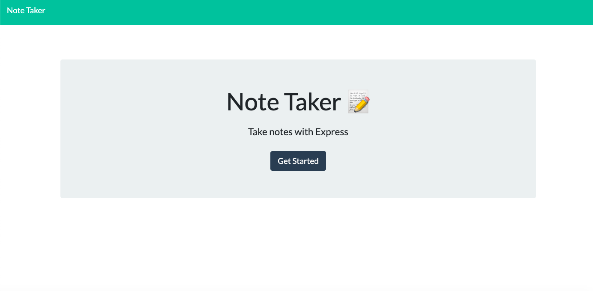
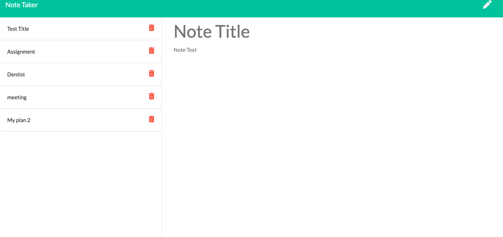

# 11 Express.js: Note Taker
<h3>BCS Homework Week11</h3>

<!-- TABLE OF CONTENTS -->

  
Table of Contents

  <ol>
    <li>
      <a href="#about-the-project">About The Project</a>
    </li>
      <li><a href="#built-with">Built With</a></li>
    <li><a href="#license">License</a></li>
    <li><a href="#contact">Contact</a></li>
  </ol>

<!-- ABOUT THE PROJECT -->
## About The Project
Using node.js express to create note taker. Also the github page has linked to heroku.
When I open the page, Initial page appears, when I clicked "Get Started" then jump to note page.
The list of notes colum is left side. Editing/ Adding note is right side column. When I write something, save bottun shows up on right top. When I press the save botton, the note added to the list and appear pn left colum. When I click adding botton, on the top, blank page appears and I can add note.
If I press delete button, the note will be deleted from the list.

[![initial page]
[![note page]

## Built With

This section should list any major frameworks that you built your project using. Leave any add-ons/plugins for the acknowledgements section. Here are a few examples.

* [Express](https://expressjs.com/)
* [Heroku](https://dashboard.heroku.com/)

## What I learn from the assignment

Just basic syntax of how to build backend function using node express. This assingment was pretty straight forward. Good to get a practice of using express.

<!-- LICENSE -->
## License

<!-- CONTACT -->
## Contact

Tomomi Inoue - 
 
 
Project Link: [https://github.com/Chib1co/Your-Note-Taker](https://github.com/Chib1co/Your-Note-Taker)

Heroku page: [https://limitless-depths-93347.herokuapp.com/](https://limitless-depths-93347.herokuapp.com/)

